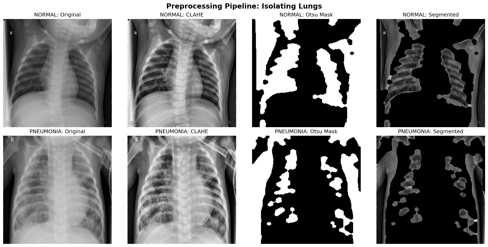
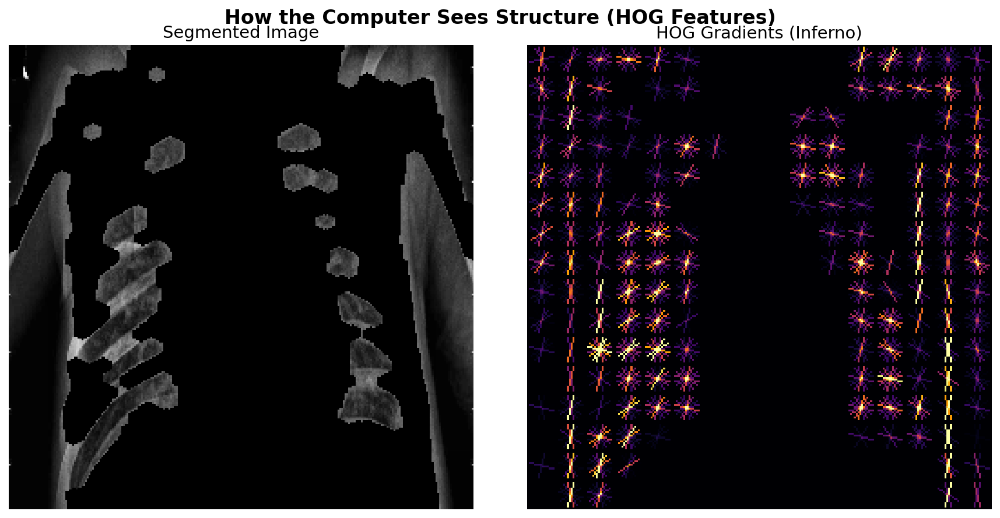
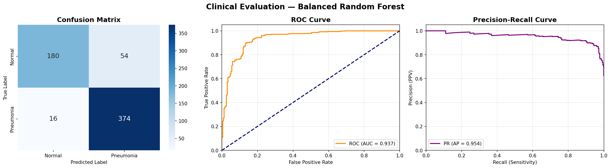
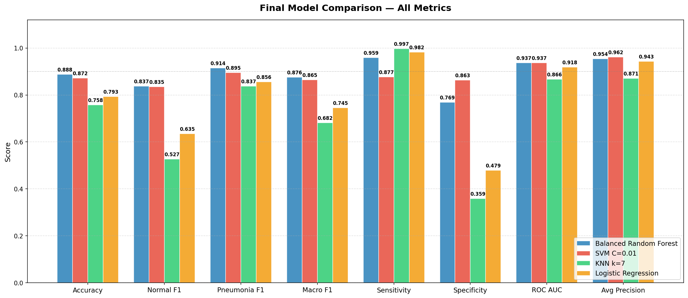

# PneumoVision: Pneumonia Detection from Chest X-Rays

An interpretable, classical machine learning pipeline for binary pneumonia classification from medical images.

   

## Project Overview
Pneumonia is a severe respiratory infection that requires rapid, accurate diagnosis. Interpreting chest X-rays can be prone to human error and relies heavily on the availability of expert radiologists. 

The **ClearLung** project provides an automated, interpretable classical machine learning pipeline designed to classify chest X-rays into **Normal** or **Pneumonia** categories. Built as a clinical decision-support tool, this system deliberately avoids deep learning "black boxes" in favor of deterministic computer vision and handcrafted feature engineering.

### The Clinical Challenge: Imbalance & Sensitivity
Medical datasets are rarely balanced. Our dataset is heavily skewed towards Pneumonia cases, presenting a high risk of model bias. 

In a clinical diagnostic setting, minimizing False Negatives is the absolute highest priority. Therefore, the primary evaluation metric for this system is **Sensitivity (Recall for the Pneumonia class)**, ensuring that patients with the disease are correctly identified and do not leave the clinic untreated.

---

## Methodology & Architecture

The pipeline evolved into a highly refined **Clinical Imaging Approach** consisting of strict preprocessing, feature extraction, and algorithmic balancing.

### 1. Image Preprocessing & Lung Masking
Rather than feeding raw pixels to a model, the pipeline isolates the actual region of interest:
* Images are standardized to `256x256`.
* **CLAHE** (Contrast Limited Adaptive Histogram Equalization) is applied to enhance localized tissue contrast.
* Gaussian blurring and **Otsu's Thresholding** are combined with morphological operations (opening/closing) to generate clean lung masks, isolating the lung field from the background bone and tissue.
* *(Note: Standard, non-mirrored spatial filters are strictly enforced during this step).*


*(Fig 1: The preprocessing pipeline isolating the lung cavity)*

### 2. Feature Extraction (8,140-Dimensional Vector)
We extracted features that directly correlate with visual indicators of pneumonia:
* **HOG (Histogram of Oriented Gradients):** Captures structural edges and bounding shapes within the lung cavity.
* **GLCM (Gray-Level Co-occurrence Matrix):** Extracts spatial textural features to detect cloudiness and opacities typical of fluid consolidation.


*(Fig 2: HOG visualization extracting structural edges from the lung cavity)*

**Ablation Study Note (PCA vs. Raw Features):** Initially, Principal Component Analysis (PCA) was used to compress the ~8,000 HOG features down to 50. However, this discarded 65% of the variance, causing accuracy to plummet to ~70%. We discarded PCA entirely—preserving the raw features boosted accuracy to ~89% and maximized clinical recall.

### 3. Modeling & Algorithmic Balancing
We evaluated four classical algorithms: Balanced Random Forest, SVM (RBF, C=0.01), KNN, and Logistic Regression. To handle the class imbalance without introducing synthetic noise (like SMOTE), we relied on native algorithmic class weighting via the `imblearn` library.

---

## Final Results

The models were trained using Stratified 5-Fold Cross-Validation on the full raw feature set (5,216 training images).

### Top Performer: Balanced Random Forest
The Balanced Random Forest proved to be the most clinically viable model, achieving the best trade-off between Sensitivity and Macro F1. By successfully identifying nearly 96% of all pneumonia cases, this model satisfies the strict medical objective of minimizing dangerous False Negatives.

<table>
<tr>
<td valign="top">

**Classification Report**

| Class | Precision | Recall | F1-Score | Support |
| :--- | :---: | :---: | :---: | :---: |
| **Normal** | 0.92 | 0.77 | 0.84 | 234 |
| **Pneumonia** | 0.87 | 0.96 | 0.91 | 390 |
| *Macro Avg* | *0.90* | *0.86* | *0.88* | *624* |
| *Weighted Avg* | *0.89* | *0.89* | *0.89* | *624* |

</td>
<td valign="top">

**Clinical Evaluation Metrics**

| Metric | Score |
| :--- | :---: |
| **Accuracy** | **0.8878** |
| **Sensitivity** (Pneumonia Recall) | **0.9590** |
| **Specificity** (Normal Recall) | **0.7692** |
| **ROC AUC** | **0.9368** |
| **Average Precision** | **0.9539** |

</td>
</tr>
</table>


*(Fig 3: Clinical metrics and confusion matrix for the Balanced Random Forest)*

### Model Comparison
While the SVM ($C=0.01$, RBF kernel) achieved a slightly higher specificity (86.32%), its sensitivity drop to 87.69% made it less ideal for a strict medical screening scenario where catching the disease is the top priority.


*(Fig 4: Performance comparison across tested models)*

---

## Repository Structure

```text
├── data/
│   └── chest_xray/          # Kaggle Dataset (Train, Test, Val splits)
├── deployment-Website/      # Flask/FastAPI backend & frontend files
├── figures/                 # Project charts, confusion matrices, and pipeline diagrams
├── models/                  # Saved .pkl model artifacts and standard scalers
├── notebooks/
│   └── Feature_Extraction_Approach.ipynb  # Interactive EDA and ablation studies
├── report/                  # IEEE formatted project documentation and PDF reports
├── results/                 # Evaluation outputs and CV stability graphs
├── src/                     # Core pipeline source code
│   ├── download_data.py
│   ├── preprocess.py
│   ├── features.py
│   ├── train.py
│   ├── predict.py
│   └── evaluate.py
├── .gitignore               # Ignores data/, models/, .venv/, and .idea/
├── requirements.txt         # Project dependencies
└── README.md
